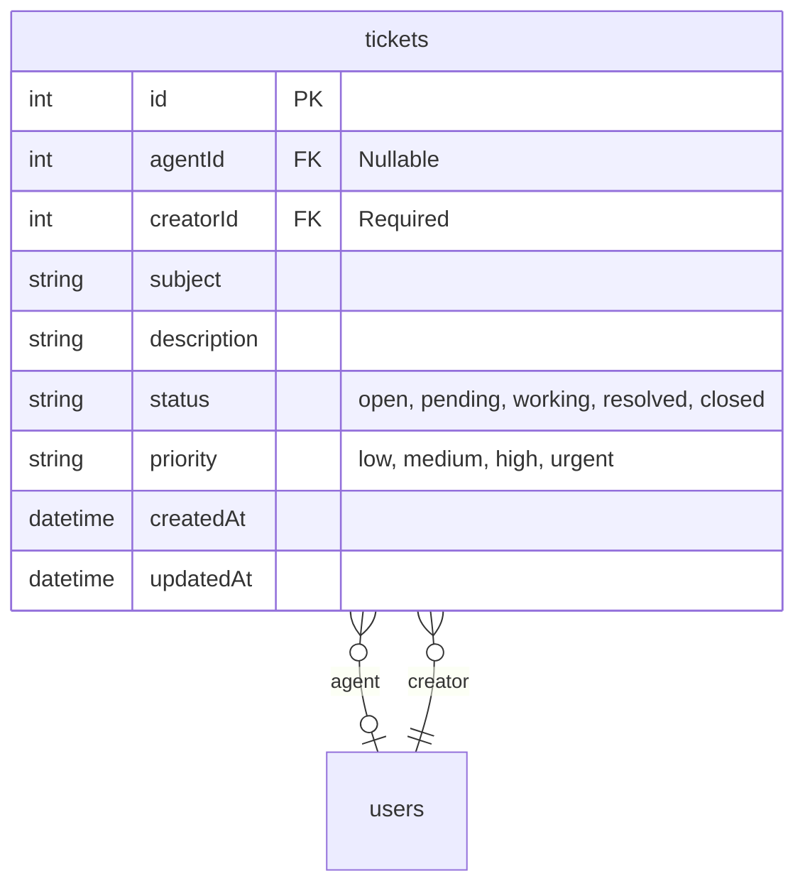
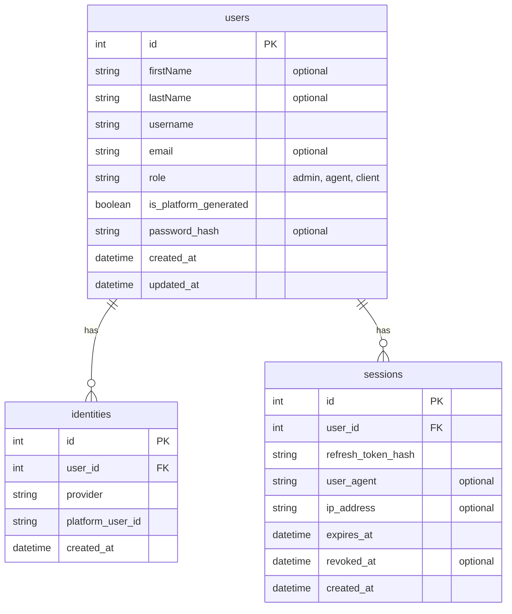

# ticketbasics database

## Core

```mermaid
erDiagram
    tickets {
        int id PK
        int agentId FK "Nullable"
        int creatorId FK "Required"
        string subject
        string description
        string status "open, pending, working, resolved, closed"
        string priority "low, medium, high, urgent"
        datetime createdAt
        datetime updatedAt
    }

    users {}

    tickets }o--|o users : agent
    tickets }o--|| users : creator
```

## Auth

```mermaid
erDiagram
    users {
        int id PK
        string firstName "optional"
        string lastName "optional"
        string username
        string email "optional"
        string role "admin, agent, client"
        boolean is_platform_generated
        string password_hash "optional"
        datetime created_at
        datetime updated_at
    }

    identities {
        int id PK
        int user_id FK
        string provider
        string platform_user_id
        datetime created_at
    }

    sessions {
        int id PK
        int user_id FK
        string refresh_token_hash
        string user_agent "optional"
        string ip_address "optional"
        datetime expires_at
        datetime revoked_at "optional"
        datetime created_at
    }

    users ||--o{ identities : has
    users ||--o{ sessions : has
```